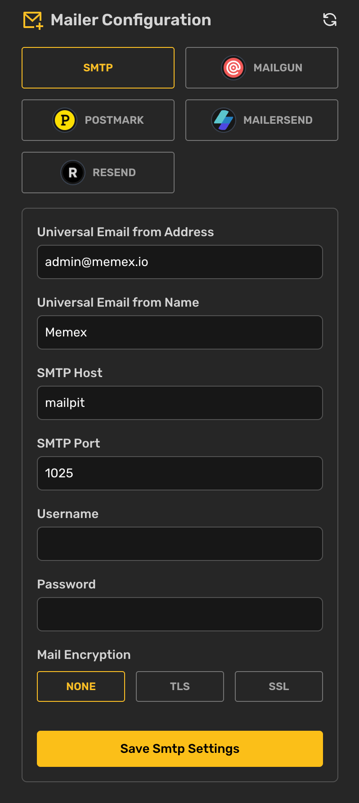

# Admin Settings.

## Email Service Configuration Guide

### Overview

The Email Configuration interface provides a user-friendly way to manage email service settings without directly editing environment variables. This guide explains each available service and its configuration options.

### Universal Settings

These settings are shared across all email service configurations:

* **Universal Email from Address**: The email address that appears as the sender (e.g., admin@memex.io)
* **Universal Email from Name**: The display name that appears as the sender (e.g., Memex)

_Note: These settings are synchronized across all email service configurations. Updating these values in one service will automatically update them for all other services._

### Available Email Services

#### SMTP

Standard email protocol suitable for most email providers.\

<figure><figcaption></figcaption></figure>

Configuration fields:

* SMTP Host: Your email server's hostname (e.g., mailpit)
* SMTP Port: The port number for your email server (e.g., 1025)
* Username: Your SMTP server username
* Password: Your SMTP server password
* Mail Encryption: Choose between:
  * NONE: No encryption
  * TLS: Transport Layer Security encryption
  * SSL: Secure Sockets Layer encryption

#### Mailgun

Email service provider offering reliable email delivery.

<figure><figcaption></figcaption></figure>

Configuration fields:

* Mailgun Secret Key: Your Mailgun API secret key
* Mailgun Domain: Your configured Mailgun domain
* Mailgun Endpoint: API endpoint (default: api.mailgun.net)

#### MailerSend

Transactional email service provider.

<figure><figcaption></figcaption></figure>

Configuration fields:

* MailerSend API Key: Your MailerSend API key

#### Postmark

Email delivery service focused on transactional email.

<figure><figcaption></figcaption></figure>

Configuration fields:

* Postmark API Token: Your Postmark server API token

#### Resend

Modern email delivery service.

Configuration fields:

* Resend API Key: Your Resend API key

### How to Configure

1. Select your preferred email service by clicking on its tab in the configuration interface
2. Fill in the Universal Email settings if not already configured
3. Enter the required credentials for your chosen service
4. Click the "Save \[Service] Settings" button to apply your configuration

### Important Notes

* Only one email service can be active at a time
* All changes are saved to your environment configuration file
* It's recommended to test your email configuration after making changes
* Keep your API keys and credentials secure and never share them
* Some services may require additional setup in their respective dashboards
* All email services use the Universal Email settings for the sender's identity

### Security Considerations

* When using SMTP, choose TLS or SSL encryption when possible
* Regularly rotate API keys and credentials
* Monitor your email service dashboard for any unusual activity
* Keep your email service provider's security recommendations in mind

&#x20;
