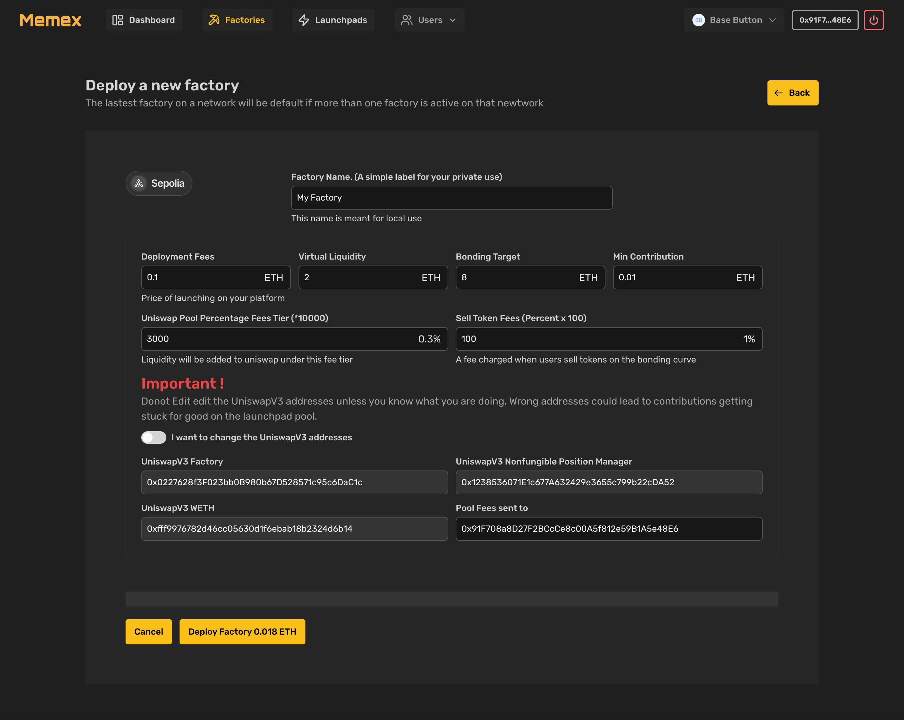

# Create a factory

<figure><figcaption></figcaption></figure>

The create factory ui provides an interface for deploying and configuring your bonding curve factory. This guide will walk you through each parameter and section of the deployment interface.

### Basic Information

#### <mark style="color:yellow;">Factory Name</mark>

* Located at the top of the form
* Enter a simple label for your private use
* This name is for local reference only and won't be stored on-chain
* Example: "My Factory" or "Test Factory 1"

### Economic Parameters

#### <mark style="color:yellow;">Deployment Fees (ETH)</mark>

* The cost to deploy a new bonding curve through your factory
* This fee will be paid by projects launching through your factory
* Consider market conditions when setting this value.

#### <mark style="color:yellow;">Virtual Liquidity (ETH)</mark>

* The initial virtual ETH backing the bonding curve
* Virtual ETH determines the initial price of the Tokens via the AMM constant product model, so the final effect is similar to providing liquidity of total tokens and virtual ETH amount
* Higher values create more price stability
* Affects initial token price and curve behavior during bonding.

#### <mark style="color:yellow;">Bonding Target (ETH/BNB/SOL etc)</mark>

* Total Native amount to be collected before curve finalization and liquidity migration
* The amount determines the final marketcap at bonding close.
* Ensure the  bonding tartget is  greater than Virtual ETH
* Determines when the curve can transition to Uniswap V3

#### <mark style="color:yellow;">Minimum Contribution (ETH)</mark>

* Smallest allowed contribution (BUY) amount for thr launchpad. while the sale can be small this forces all buys to be at least this amount.
* Prevents dust transactions
* Should balance accessibility with gas efficiency

### Fee Structure

#### <mark style="color:yellow;">Uniswap Pool Percentage Fees</mark>

* Fee tier for the eventual Uniswap V3 pool in BIPS
* This is basically common percent X 10000 to allow for small precentage fee fractions eg 0.1%
* Use the Standard options: 0.01%, 0.05%, 0.3%, 1% based on the uniswap pools fee structure
* Higher fees = more earnings but less trading volume

#### <mark style="color:yellow;">Sell Token Fees</mark>

* Fee charged when users sell tokens on the bonding curve
* Applied before Uniswap migration
* Accrues to the fee recipient address, The fees will need to be withdrawn by the fee recipient address. It would advice that you add is to admin address list, since the fee collection ui in the admin side

### Advanced Settings

#### <mark style="color:yellow;">UniswapV3 Addresses</mark>

WARNING: Do not modify these unless you absolutely know what you're doing!

These are the addresses of the uniswpv3 compartible swap that liquidity will be migrated to.

* Factory: 0x227628f3F023bb0B980b7D528571c95c6DaC1c
* Position Manager: 0x123853607fE1c677A632429e3655c799b22cDA52
* WETH: 0xff9976782d46cc05630d1f6ebab18b2324d6b14
* Fee Recipient, Trading fees will be sent to this adress. The fees will be forwarded as users swap and trade, there is no need to withdraw the fees.

#### Control Toggle

* "I want to change the UniswapV3 addresses"
* Disabled by default for safety
* Only enable if you need to deploy on a different swap ot use custom contracts

### Deployment

#### Final Steps

1. Review all parameters carefully
2. Click "Deploy Factory" button
3. Confirm transaction in your wallet
4. Factory deployment fee: 0.018 ETH

#### After Deployment

* Your factory will be registered on the network
* Projects can begin launching through your factory
* You'll receive fees from deployments and token sales
* Monitor your factory through the dashboard

### Important Notes

* All fees and parameters are immutable after deployment in the frontend. Changing parameters will only affect contracts deployed after parameters were changed.
* Ensure all addresses are correct for your target network
* If you plan to use another swap, always Test with smaller values on testnet first

### Support

If you need assistance or have questions:

* Check documentation at [https://docs.memex.scriptoshi.com](https://docs.memex.scriptoshi.com)
* Join our Telegram community
* Contact support through official channels discord/Telegram/X.com
