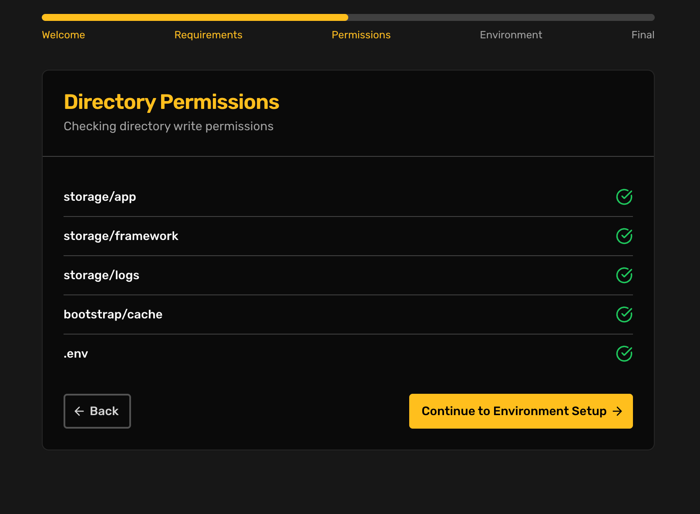

# Quickstart Cpanel

### KNOWN ISSUES ON SHARED HOSTING.

1. The software requires the laravel artisan queue worker to be monitored and running. It can be challenging to set this up on shared hosting since you need sudo privileges to setup supervisord.  If you have sudo privileges and your cpanel, this should be breeze, you add the command , _**(see the end of the page for more**_). to your supervisord conf.
2. Like the queue:worker above laravel reverb used to run websockets needs to be monitored and run via supervisord. Fortunately you can replace reverb for [pusher.com](https://pusher.com) since its a drop in subsitute.

### 1. Create a Database

Create a fresh database, choose `utf8mb4_general_ci` character encoding and add a user to the database, then grant this user all permissions to that database. Note the **database name**, **username**, and **password**.  It will be needed during installation

### 2. Unzip and upload server files

Extract the file you downloaded. In the extracted directory find **memex-server.zip,** upload this to the root folder of your domain. Extract the contents of **memex-server.zip** here.

### 3. **Change Your Document Root**

* Go back to cPanel main page
* Look for "Domain" or "Domains" section
* Click on "Domains" or "Domain Manager"
* Find your domain and click "Manage" or the gear/settings icon
* Look for "Document Root" or "Directory"
* Add `/public` to the end of your current path
* Example: If current path is `/home/username/public_html`, change it to `/home/username/public_html/public`
* Save changes

**Alternative Method** (if above option isn't available):

* Contact your hosting provider
* Ask them to change the document root to point to the `/public` folder inside the uploaded files.

**Important Notes:**

* This change may take a few minutes to take effect
* Make sure all your memex files are properly uploaded before making this change
* If your site shows errors, double-check the path is correct

### 3. Run the installer.

Visit your site in the browser. The installer should load. &#x20;

Follow the instructions on the screen.

#### 2. Web Installer

Once you've completed the initial setup, the web installer will automatically launch when you visit your application URL. The installer guides you through the following steps:

**Step 1: Welcome**

<figure><figcaption></figcaption></figure>

* Introduction to the installation process
* Prerequisites checklist

**Step 2: Requirements Check**

<figure><figcaption></figcaption></figure>

* Automatically checks PHP version
* Verifies required PHP extensions
* Displays status of each requirement

**Step 3: Permissions Check**

<figure><figcaption></figcaption></figure>

The following directories need to be writable:

* `storage/app`
* `storage/framework`
* `storage/logs`
* `bootstrap/cache`
* `.env`

**Step 4: Environment Configuration**

<figure><figcaption></figcaption></figure>

**Application Settings**

* Application URL
* CoinCap API Key
* Project ID
* Ankr API Key
* Admin Wallet Addresses (comma-separated).  To access admin simply sign the messages with any of the admin wallet addresses.

**Database Configuration**

* Database Type (MySQL, PostgreSQL, SQLite, SQL Server)
* Host
* Port
* Database Name
* Username
* Password

### Post-Installation

After the installation is complete:

1. The application will automatically:
   * Create necessary database tables
   * Set up initial configurations
   * Generate application key
   * Create storage links
2. You should:
   * Configure additional environment variables if needed
   * Set up cron jobs for scheduled tasks
   * Configure your web server
   * Set up SSL certificates

### Troubleshooting

#### Common Issues

**Database Connection Fails**

* Verify database credentials
* Ensure database server is running
* Check if database exists and user has proper permissions
* Confirm firewall settings allow connection on the provided port

**Permission Issues**

```bash
# Fix storage permissions
chmod -R 775 storage bootstrap/cache
chown -R www-data:www-data storage bootstrap/cache
```

**Installation Process Hangs**

* Check PHP timeout settings
* Verify server memory limits
* Ensure all required services are running

#### Installation Log

The installation process creates a log file at `storage/logs/installer.log`. Check this file for detailed error messages if you encounter issues.

### Security Considerations

After installation:

1. Remove write permissions from `.env` file
2. Secure your API keys
3. Change default database credentials
4. Enable HTTPS
5. Set up proper firewall rules

### Updating

The installer creates a file at `storage/app/installed` to track installation status. To reinstall:

1. Delete this file
2. Clear application cache
3. Access the application URL to restart installation

